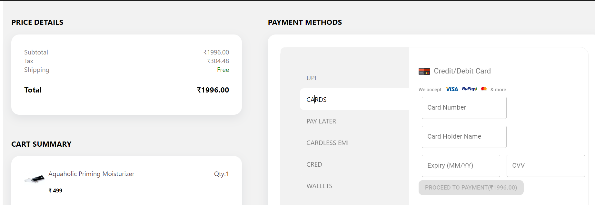
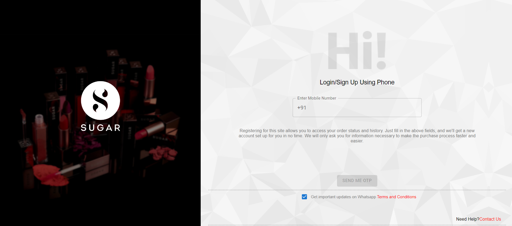
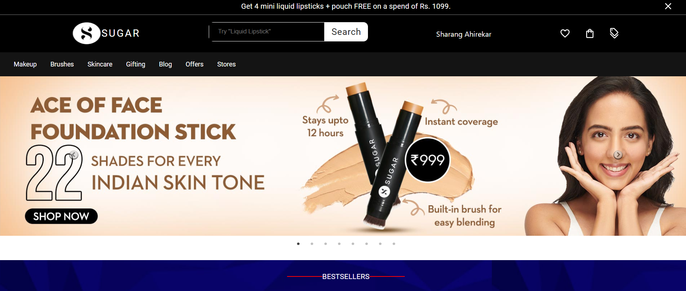

#### SUGAR COSMETICS CLONE ###
SUGAR Cosmetics is a leading Indian cosmetics brand known for its high-quality, affordable products. The company was founded in 2012 by Vineeta Singh and Kaushik Mukherjee, who have both faced their fair share of struggles on their journey to success.

#### About Project ####
This is a team project, built by us in the Construct Week - Unit 6 at Masai School. The project is made using Nextjs

#### PAGES AND FEATURES ####
User can login using his phone number and save his details

After logging in he would add the products in the cart and also in wishlist

The user can manage his cart items and his wishlist

In Checkout the user can select different mode of payment and move to completing the order.

#### SCREENSHOTS ####

#### TECH STACK ####
 - NextJS
 - MongoDB
 - Firebase
 - Material UI

 #### ROLES AND RESPONSIBILITES ####
 Checkout page and the cart items components. 
 User Interface for selecting different payment modes.
 Designing of the card components. 
 Best coding practises.
